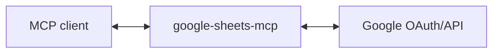

# google-sheets-mcp

MCP server for Google Sheets - read, write, and query spreadsheet data.

## Use Cases

**Data questions**: "How many open deals are in the pipeline?" or "What's our total Q3 revenue?" → reads the spreadsheet and answers directly.

**Quick expense entry**: Snap a photo of a receipt → extracts the details and appends a row to your expense tracker.

**Cross-tool status sync**: "Check all our vendor Slack channels and update the tracking spreadsheet with their latest updates" → reads Slack, updates the sheet.

**Data analysis**: "Break down the Salesforce figures by region and compare against our events calendar" → pulls data from multiple sources into a spreadsheet for analysis.

(These are just examples - any workflow that needs spreadsheet data can use this. Use in combination with [google-drive-mcp](https://github.com/domdomegg/google-drive-mcp) for finding files, deleting, comments, and sharing permissions.)

## Setup

### 1. Create Google OAuth credentials

1. Go to [Google Cloud Console](https://console.cloud.google.com/)
2. Create a new project (or use existing)
3. Enable the Google Sheets API
4. Go to **APIs & Services** → **OAuth consent screen**, set up consent screen
5. Go to **APIs & Services** → **Credentials** → **Create Credentials** → **OAuth client ID**
6. Choose **Web application**
7. Add `http://localhost:3000/callback` to **Authorized redirect URIs**
8. Note your Client ID and Client Secret

### 2. Run the server

```bash
GOOGLE_CLIENT_ID='your-client-id' \
GOOGLE_CLIENT_SECRET='your-client-secret' \
MCP_TRANSPORT=http \
npm start
```

The server runs on `http://localhost:3000` by default. Change with `PORT=3001`.

### 3. Add to your MCP client

```bash
claude mcp add --transport http google-sheets-mcp http://localhost:3000/mcp
```

## Architecture

This server acts as an **OAuth proxy** to Google:



1. Server advertises itself as an OAuth authorization server via `/.well-known/oauth-authorization-server`
2. `/register` returns the Google OAuth client credentials
3. `/authorize` redirects to Google, encoding the client's callback URL in state
4. `/callback` receives the code from Google and forwards to the client's callback
5. `/token` proxies token requests to Google, injecting client credentials
6. `/mcp` handles MCP requests, using the bearer token to call Google Sheets API

The server holds no tokens or state - it just proxies OAuth to Google.

## Tools

| Tool | Description |
|------|-------------|
| **Spreadsheet** | |
| `sheets_spreadsheet_get` | Get spreadsheet metadata (title, sheets list, optionally cell data) |
| `sheets_spreadsheet_create` | Create a new spreadsheet |
| **Values** | |
| `sheets_values_get` | Read cell values from a range |
| `sheets_values_batch_get` | Read cell values from multiple ranges |
| `sheets_values_update` | Write cell values to a range (overwrites) |
| `sheets_values_batch_update` | Write cell values to multiple ranges |
| `sheets_values_append` | Append rows after existing data |
| `sheets_values_clear` | Clear cell values from a range |
| **Sheets (tabs)** | |
| `sheets_sheets_list` | List all sheets in a spreadsheet |
| `sheets_sheet_add` | Add a new sheet (tab) |
| `sheets_sheet_delete` | Delete a sheet (tab) |
| **Advanced** | |
| `sheets_batch_update` | Execute batch operations (formatting, merging, filters, etc.) |

## Google Sheets API Scope

- `spreadsheets` - Full read/write access to spreadsheets

## Contributing

Pull requests are welcomed on GitHub! To get started:

1. Install Git and Node.js
2. Clone the repository
3. Install dependencies with `npm install`
4. Run `npm run test` to run tests
5. Build with `npm run build`

## Releases

Versions follow the [semantic versioning spec](https://semver.org/).

To release:

1. Use `npm version <major | minor | patch>` to bump the version
2. Run `git push --follow-tags` to push with tags
3. Wait for GitHub Actions to publish to the NPM registry.
